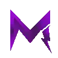

# 💜 RP MIRANO

Bienvenue sur le wiki **Mirano**, un serveur RolePlay FiveM.

Rejoignez le serveur Discord : [https://discord.gg/yxtfkjVWM](https://discord.gg/yxtfkjVWM)

***

## 📑 Règlement

* [Règlement](reglement-de-mirano/reglement/)
  * [Règlement Streaming](reglement-de-mirano/reglement/reglement-streaming.md)
  * [Information RP](/broken/pages/9VCToLy4B4veJj6KmScM)
    * [Coma](reglement-de-mirano/reglement/information-rp/coma.md)
    * [Mort RP](reglement-de-mirano/reglement/information-rp/mort-rp.md)

## 🗺️ Légal & Illégal

* [Légal & Illégal](/broken/pages/PCLgjGgW4zDM10L6NVEs)
  * [Règlement Général](reglement-de-mirano/reglement/reglement-general.md)
  *   💚 [Règlement Légal](reglement-de-mirano/reglement/reglement-legal/)

      📔[Notes des entreprises](reglement-de-mirano/reglement/reglement-legal/notes-des-entreprises.md)

      * [Devenir patron d'une entreprise](reglement-de-mirano/reglement/reglement-legal/devenir-patron-dune-entreprise.md)
      * [Rôles des forces de l'ordre](reglement-de-mirano/reglement/reglement-legal/roles-des-forces-de-lordre.md)
      * [Règlement des forces de l'ordre et EMS](reglement-de-mirano/reglement/reglement-legal/reglement-des-forces-de-lordre-et-ems.md)
  * [Sanctions](reglement-de-mirano/reglement/reglement-legal/sanctions.md)
  * [Charte des sanctions](reglement-de-mirano/aide/charte-sanctions.md)
  * [Règlement Illégal](reglement-de-mirano/reglement/reglement-illegal/)
    * [Notes des organisations/gangs](reglement-de-mirano/reglement/reglement-illegal/notes-des-organisations-gangs.md)
    * [Devenir patron d'une organisation / d'un gang](reglement-de-mirano/reglement/reglement-illegal/devenir-patron-dune-organisation-dun-gang.md)
    * [Règlement des activités illégales](reglement-de-mirano/reglement/reglement-illegal/reglement-des-activites-illegal.md)
    * [Règlement descente](reglement-de-mirano/reglement/reglement-illegal/reglement-descente.md)
  * [Règlement Staff](/broken/pages/Ey54TYM4uwTHwKglTtw9)

## ⚙️ Aide & Information

* [Connexion au serveur](aide-et-information/connexion.md)
* [Discord Mirano](aide-et-information/discord.md)
* 🛍️ [Boutique](aide-et-information/boutique/boutique.md)
  * [Comment acheter des MiranoCoins](aide-et-information/boutique/comment-acheter-des-miranocoins.md)
  * [Comment acheter le VIP](aide-et-information/boutique/comment-acheter-le-vip.md)
  * [Historique d'achat](aide-et-information/boutique/historique-dachat.md)
  * [Armes permanentes](aide-et-information/boutique/armes-permanetes.md)
  * [Remboursement](/broken/pages/nQmVJmrch7FLQFXP66TV)
    * [MiranoCoins non reçues](aide-et-information/boutique/remboursement/miranocoin-non-recu.md)
    * [VIP non reçu](aide-et-information/boutique/remboursement/vip-non-recu.md)
    * [Extra non reçu](aide-et-information/boutique/remboursement/extra-non-recu.md)
    * [Arrêter un VIP](aide-et-information/boutique/remboursement/arreter-un-vip.md)
* 🐛 [Bugs & Problèmes](/broken/pages/plBrAOWZG5VxTasO6YNn)
  * [Vider son cache](/broken/pages/yU7SaYs9rhtPXGDdFDN4)
  * [Map qui ne charge pas](/broken/pages/ta6XtnTR03y0rk7QMf04)

***

> Source : [wiki.mirano.fr](https://wiki.mirano.fr/)
